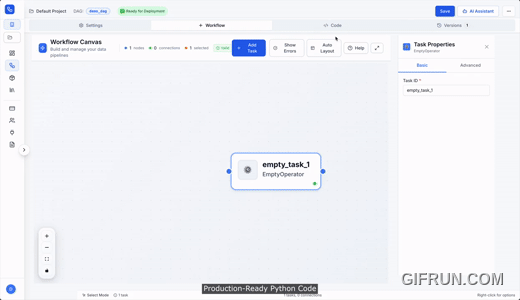

# DAGForge

🚀 **Build Airflow DAGs with AI in minutes, not weeks**

DAGForge is the only platform that combines AI-powered code generation with visual drag-and-drop to build Apache Airflow DAGs. Describe your pipeline in plain English or build visually—get production-ready Airflow DAGs instantly.

## ✨ Features

- **🤖 AI-Powered Code Generation** - Describe pipelines in plain English, get production-ready Python code
- **🎨 Visual Drag-and-Drop Editor** - Build complex workflows without writing code
- **✅ Production-Ready Output** - Complete implementations with error handling, logging, and best practices
- **🔍 Real-Time Validation** - Catch errors before deployment
- **🚀 One-Click Deployment** - Deploy to your Airflow instance instantly
- **🔒 Enterprise Security** - SOC 2 ready, multi-tenant architecture

## 🎯 Why DAGForge?

Building Airflow DAGs manually takes weeks. Data engineers waste time:
- Writing boilerplate code
- Debugging syntax errors
- Managing complex dependencies
- Hard to visualize workflows

**DAGForge solves this:**
- Save 10+ hours per DAG
- Build in minutes, not weeks
- Production-ready code from day one
- Visual workflow design

## 🚀 Quick Start

1. **Sign up free**: [dagforge.com](https://dagforge.com)
2. **Describe your pipeline**: "Extract from PostgreSQL, transform, load to BigQuery daily"
3. **Get production-ready code**: AI generates complete Airflow DAG
4. **Deploy**: One-click deployment to your Airflow instance

## 📚 Documentation

- [Getting Started Guide](https://dagforge.com/docs)
- [Examples](https://dagforge.com/docs)
- [Support & FAQ](https://dagforge.com/docs)

## 💬 Community

- **Discussions**: Ask questions, share ideas, get help
- **Issues**: Report bugs, request features
- **Twitter**: [@anvtek](https://x.com/anvtek)
- **Website**: [dagforge.com](https://dagforge.com)

## 🤝 Contributing

We welcome contributions! Please see our [Contributing Guide](CONTRIBUTING.md) for details.

## 📝 License

Copyright © 2025 ANVTEK. All rights reserved.

## 🔗 Links

- **Website**: [dagforge.com](https://dagforge.com)
- **Documentation**: [dagforge.com/docs](https://dagforge.com/docs)
- **Twitter**: [@anvtek](https://x.com/anvtek)
- **Company**: [anvtek.com](https://anvtek.com)

## ⭐ Show Your Support

If you find DAGForge useful, please give us a star ⭐ and share it with your network!

---

**Built with ❤️ by [ANVTEK](https://anvtek.com)**

